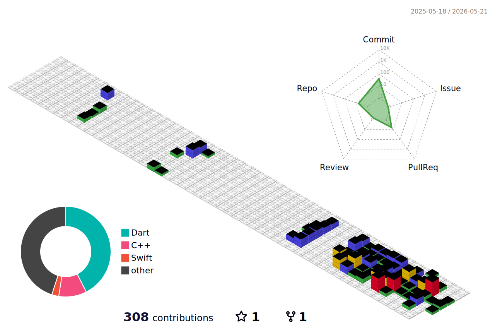

### Hey there 👋, I'm Victor

  
  
* repo from: https://github.com/yoshi389111/github-profile-3d-contrib

  

**Languages and Tools:**
  

<!--
**HuangLiang-Jun/HuangLiang-Jun** is a ✨ _special_ ✨ repository because its `README.md` (this file) appears on your GitHub profile.

Here are some ideas to get you started:

- 🔭 I’m currently working on ...
- 🌱 I’m currently learning ...
- 👯 I’m looking to collaborate on ...
- 🤔 I’m looking for help with ...
- 💬 Ask me about ...
- 📫 How to reach me: ...
- 😄 Pronouns: ...
- ⚡ Fun fact: ...
-->
